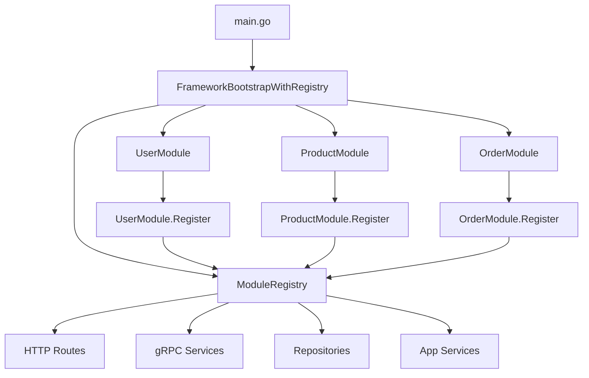
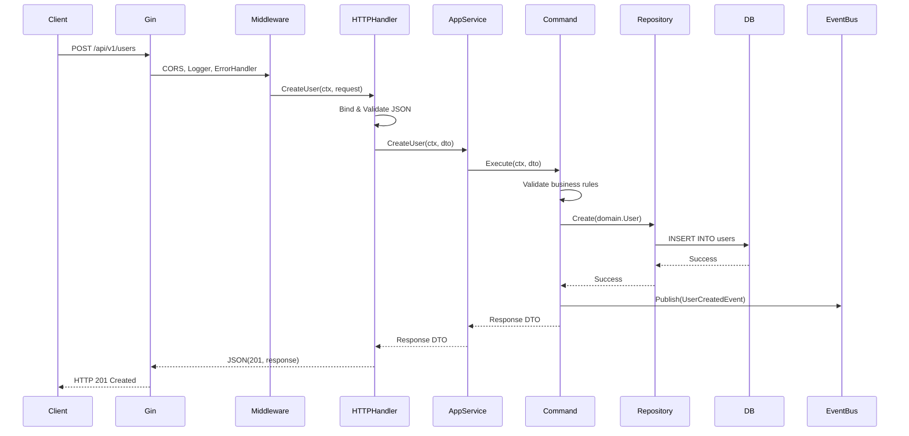
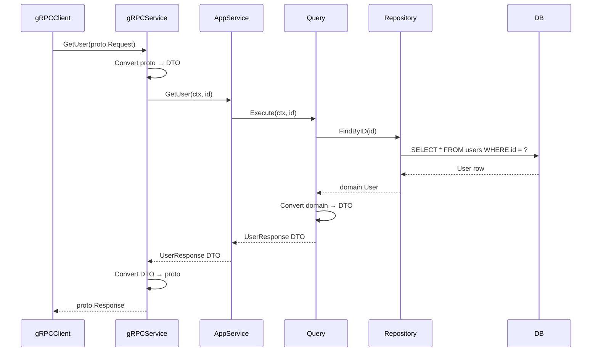
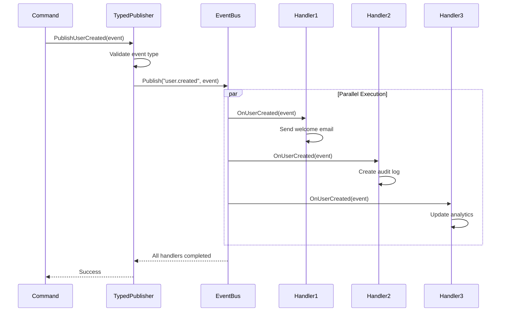
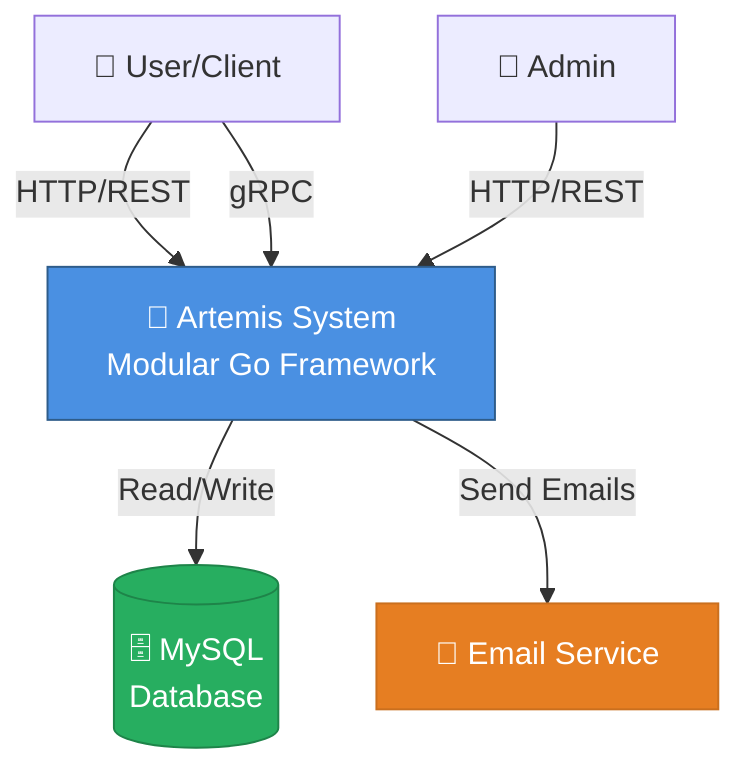
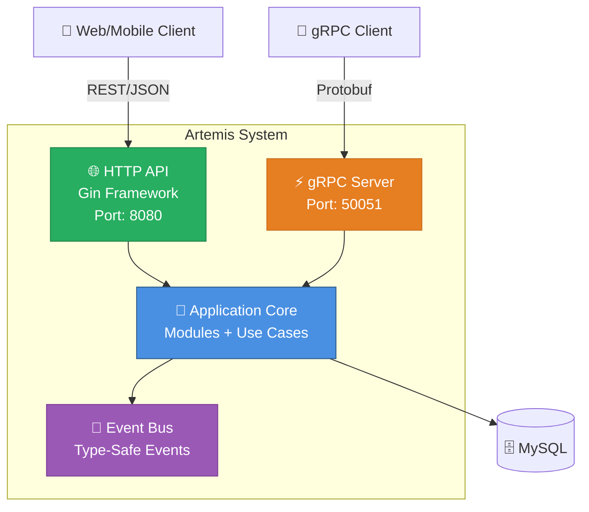
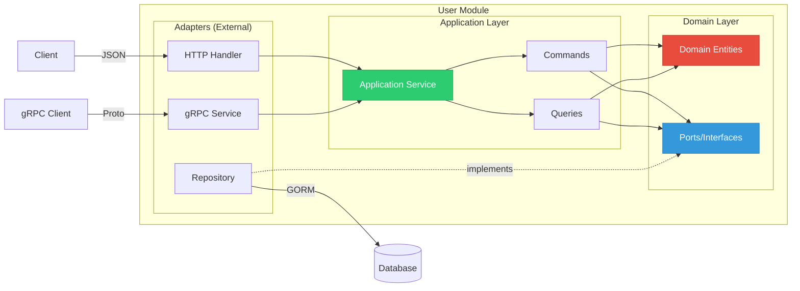
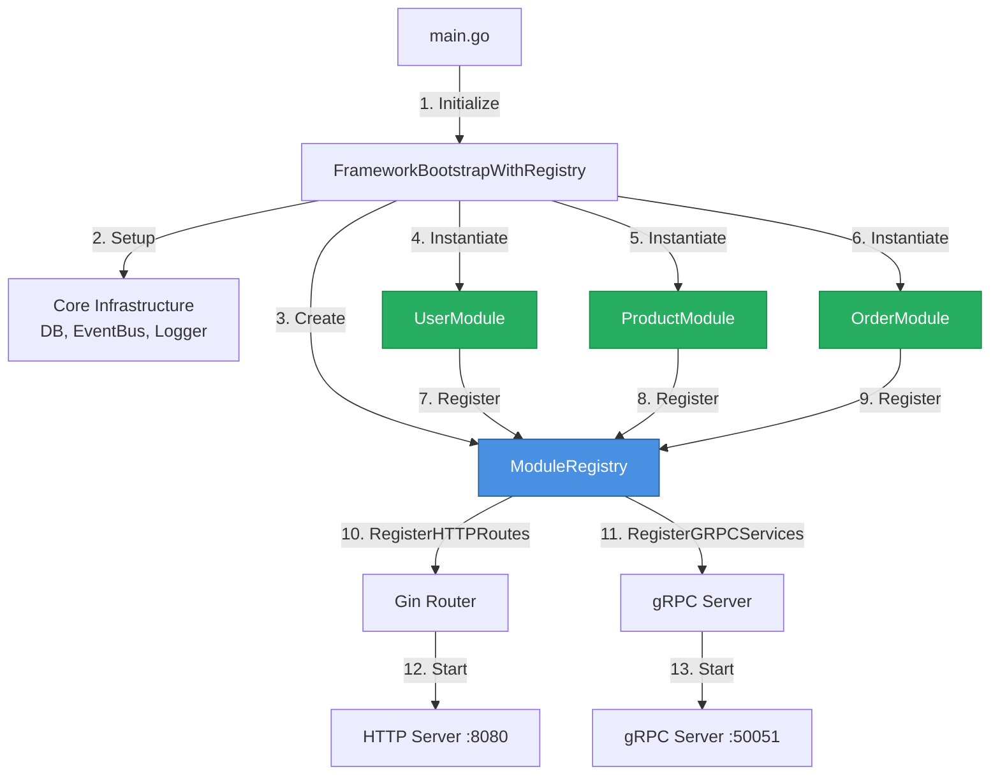

# 🏗️ Arquitetura do Projeto Artemis

> **Framework modular em Go** combinando Clean Architecture, Hexagonal Architecture e Domain-Driven Design (DDD)

## 📋 Índice

- [Visão Geral](#visão-geral)
- [Princípios Arquiteturais](#princípios-arquiteturais)
- [Estrutura de Diretórios](#estrutura-de-diretórios)
- [Camadas da Aplicação](#camadas-da-aplicação)
- [Sistema de Auto-Registro](#sistema-de-auto-registro)
- [Fluxo de Requisições](#fluxo-de-requisições)
- [Diagramas](#diagramas)

---

## 🎯 Visão Geral

O **Artemis** é um framework modular construído em Go que implementa padrões de arquitetura de software modernos para criar aplicações escaláveis, testáveis e de fácil manutenção.

### Características Principais

- ✅ **Clean Architecture** - Separação clara de responsabilidades
- ✅ **Hexagonal Architecture** - Portas e adaptadores desacoplados
- ✅ **Domain-Driven Design** - Domínio rico e isolado
- ✅ **CQRS** - Separação entre Commands e Queries
- ✅ **Event-Driven** - Event Bus type-safe com suporte a eventos tipados
- ✅ **Auto-Registro** - Módulos self-registering com zero boilerplate
- ✅ **Dependency Injection** - Container IoC integrado
- ✅ **Multi-Protocol** - HTTP (Gin) + gRPC

### Tecnologias

| Categoria | Tecnologia |
|-----------|-----------|
| **Linguagem** | Go 1.24+ |
| **HTTP Framework** | Gin v1.11.0 |
| **gRPC** | google.golang.org/grpc v1.76.0 |
| **ORM** | GORM v1.31.0 |
| **Database** | MySQL 8.0+ |
| **Protocol Buffers** | protobuf v1.36.9 |

---

## 🧭 Princípios Arquiteturais

### 1. **Dependency Rule** (Regra de Dependência)

```
┌─────────────────────────────────────────┐
│           External (Framework)          │  ← Adaptadores
├─────────────────────────────────────────┤
│       Interface Adapters (HTTP/gRPC)    │  ← Handlers
├─────────────────────────────────────────┤
│      Application (Use Cases/Commands)   │  ← Business Logic
├─────────────────────────────────────────┤
│          Domain (Entities)              │  ← Core
└─────────────────────────────────────────┘

As dependências sempre apontam PARA DENTRO (inward)
```

**Regras:**
- O **domínio** não conhece nada externo
- **Application** depende apenas do domínio
- **Adapters** implementam interfaces do domínio
- **Framework** orquestra tudo via Dependency Injection

### 2. **Separation of Concerns** (Separação de Responsabilidades)

Cada módulo é dividido em camadas bem definidas:

```
internal/modules/{module}/
├── domain/          # Regras de negócio puras (0 dependências externas)
├── ports/           # Interfaces (contratos)
├── application/     # Use Cases (Commands/Queries)
├── dto/             # Data Transfer Objects
├── adapters/        # Implementações (HTTP, gRPC, Repository)
└── repository/      # Persistência (implementa ports)
```

### 3. **Interface Segregation** (ISP)

Interfaces pequenas e específicas para cada necessidade:

```go
// ❌ MAU - Interface monolítica
type UserService interface {
    CreateUser(...)
    UpdateUser(...)
    DeleteUser(...)
    GetUser(...)
    ListUsers(...)
    ValidateCredentials(...)
}

// ✅ BOM - Interfaces segregadas
type CreateUserUseCase interface { Execute(...) }
type GetUserQuery interface { Execute(...) }
type ValidateCredentialsUseCase interface { Execute(...) }
```

### 4. **Dependency Inversion** (DIP)

Dependemos de abstrações, não de implementações concretas:

```go
// Domain define a interface (porta)
type UserRepository interface {
    Create(user *User) error
    FindByID(id string) (*User, error)
}

// Adapter implementa a interface
type MySQLUserRepository struct { ... }
func (r *MySQLUserRepository) Create(user *User) error { ... }
```

---

## 📁 Estrutura de Diretórios

```
meuApp/
├── cmd/                          # Entry points alternativos
├── internal/                     # Código privado da aplicação
│   ├── bootstrap/                # Inicialização do framework
│   │   ├── bootstrap.go          # Bootstrap legacy (deprecated)
│   │   └── bootstrap_registry.go # Bootstrap modular (atual) ⭐
│   └── modules/                  # Módulos da aplicação
│       ├── user_module.go        # Auto-registro do módulo User ⭐
│       ├── product_module.go     # Auto-registro do módulo Product ⭐
│       ├── order_module.go       # Auto-registro do módulo Order ⭐
│       ├── user/
│       │   ├── domain/           # Entidades do domínio
│       │   │   └── user.go
│       │   ├── ports/            # Interfaces (portas)
│       │   │   └── ports.go
│       │   ├── application/      # Use Cases (CQRS)
│       │   │   ├── commands/     # Comandos (write)
│       │   │   ├── queries/      # Consultas (read)
│       │   │   └── services/     # Application Service
│       │   ├── dto/              # DTOs e Mappers
│       │   ├── adapters/         # Adaptadores
│       │   │   ├── http/         # HTTP Handler (Gin)
│       │   │   ├── grpc/         # gRPC Service
│       │   │   ├── logger.go     # Logger adapter
│       │   │   └── email_service.go
│       │   ├── repository/       # Persistência
│       │   │   ├── user_model.go # Model do GORM
│       │   │   └── user_repository.go
│       │   └── errors.go         # Erros do domínio
│       ├── product/              # Mesmo padrão
│       └── order/                # Mesmo padrão
│
├── pkg/                          # Código reutilizável/público
│   ├── adapters/                 # Adaptadores de infraestrutura
│   │   ├── database/mysql/       # MySQL adapter
│   │   ├── http/middleware/      # Middlewares HTTP
│   │   └── logger/               # Logger global
│   ├── config/                   # Configurações
│   ├── container/                # Dependency Injection Container
│   │   ├── container.go          # IoC Container
│   │   └── registry.go           # Module Registry ⭐
│   ├── contracts/                # Interfaces globais
│   ├── errors/                   # Sistema de erros
│   ├── events/                   # Event Bus
│   │   ├── eventbus.go           # Event Bus base
│   │   ├── typed.go              # Type-safe wrapper ⭐
│   │   ├── types.go              # Event types
│   │   └── handlers.go           # Event handlers
│   └── framework/                # Core do framework
│       ├── framework.go          # Framework principal
│       ├── interfaces/           # Interfaces do framework
│       │   ├── provider.go
│       │   └── module.go         # Interface Module ⭐
│       └── providers/            # Providers (gRPC, Cache, etc)
│
├── proto/                        # Definições Protocol Buffers
├── docs/                         # Documentação ⭐
└── main.go                       # Entry point
```

### Legenda
- ⭐ **Novidades da Fase 6** - Sistema de auto-registro
- 📦 **Módulos** - Unidades independentes e auto-contidas
- 🔌 **Adapters** - Implementações de portas
- 🎯 **Domain** - Core business logic

---

## 🏛️ Camadas da Aplicação

### 1️⃣ Domain Layer (Camada de Domínio)

**Responsabilidade:** Regras de negócio puras, entidades do domínio

**Localização:** `internal/modules/{module}/domain/`

**Características:**
- ✅ Zero dependências externas
- ✅ Apenas structs e métodos de validação
- ✅ Imutabilidade quando possível
- ✅ Value Objects para conceitos importantes

**Exemplo:**
```go
// internal/modules/user/domain/user.go
package domain

type User struct {
    ID        string
    Username  string
    Email     string
    Password  string // Hash
    CreatedAt time.Time
    UpdatedAt time.Time
}

// Método de domínio - validação
func (u *User) IsValid() error {
    if u.Username == "" {
        return errors.New("username cannot be empty")
    }
    // ... mais validações
    return nil
}
```

---

### 2️⃣ Ports Layer (Camada de Portas)

**Responsabilidade:** Interfaces que definem contratos

**Localização:** `internal/modules/{module}/ports/`

**Tipos de Portas:**
- **Primary Ports** (Driving) - O que a aplicação OFERECE
- **Secondary Ports** (Driven) - O que a aplicação PRECISA

**Exemplo:**
```go
// internal/modules/user/ports/ports.go
package ports

// PRIMARY PORTS (o que oferecemos)
type CreateUserUseCase interface {
    Execute(ctx context.Context, req CreateUserRequest) (*CreateUserResponse, error)
}

type GetUserQuery interface {
    Execute(ctx context.Context, id string) (*User, error)
}

// SECONDARY PORTS (o que precisamos)
type UserRepository interface {
    Create(ctx context.Context, user *domain.User) error
    FindByID(ctx context.Context, id string) (*domain.User, error)
}

type PasswordHasher interface {
    Hash(password string) (string, error)
    Compare(hash, password string) bool
}

type EmailService interface {
    SendWelcomeEmail(email, username string) error
}
```

---

### 3️⃣ Application Layer (Camada de Aplicação)

**Responsabilidade:** Orquestração de use cases (CQRS)

**Localização:** `internal/modules/{module}/application/`

**Estrutura:**
```
application/
├── commands/        # Operações de escrita (Create, Update, Delete)
├── queries/         # Operações de leitura (Get, List)
└── services/        # Application Service (orquestrador)
```

**Exemplo - Command:**
```go
// internal/modules/user/application/commands/create_user.go
package commands

type CreateUserHandler struct {
    repo          ports.UserRepository
    hasher        ports.PasswordHasher
    emailService  ports.EmailService
    eventPublisher contracts.EventPublisher
}

func (h *CreateUserHandler) Execute(ctx context.Context, req dto.CreateUserRequest) (*dto.CreateUserResponse, error) {
    // 1. Validar entrada
    // 2. Hash da senha
    // 3. Criar entidade de domínio
    // 4. Persistir no repositório
    // 5. Publicar evento
    // 6. Retornar resposta
}
```

**Exemplo - Query:**
```go
// internal/modules/user/application/queries/get_user.go
package queries

type GetUserHandler struct {
    repo ports.UserRepository
}

func (h *GetUserHandler) Execute(ctx context.Context, id string) (*dto.UserResponse, error) {
    // 1. Buscar no repositório
    // 2. Converter para DTO
    // 3. Retornar
}
```

---

### 4️⃣ Adapters Layer (Camada de Adaptadores)

**Responsabilidade:** Implementar portas e conectar com mundo externo

**Localização:** `internal/modules/{module}/adapters/`

**Tipos de Adapters:**

#### A) HTTP Adapter (Gin)
```go
// adapters/http/handler.go
type UserHTTPHandler struct {
    appService *services.UserApplicationService
}

func (h *UserHTTPHandler) CreateUser(c *gin.Context) {
    var req dto.CreateUserRequest
    if err := c.ShouldBindJSON(&req); err != nil {
        c.JSON(400, gin.H{"error": err.Error()})
        return
    }
    
    resp, err := h.appService.CreateUser(c.Request.Context(), req)
    if err != nil {
        // Error handling
        return
    }
    
    c.JSON(201, resp)
}
```

#### B) gRPC Adapter
```go
// adapters/grpc/service.go
type UserGRPCService struct {
    pb.UnimplementedUserServiceServer
    appService *services.UserApplicationService
}

func (s *UserGRPCService) CreateUser(ctx context.Context, req *pb.CreateUserRequest) (*pb.CreateUserResponse, error) {
    // Converter proto → DTO
    // Chamar application service
    // Converter DTO → proto
}
```

#### C) Repository Adapter
```go
// repository/user_repository.go
type MySQLUserRepository struct {
    db *gorm.DB
}

func (r *MySQLUserRepository) Create(ctx context.Context, user *domain.User) error {
    model := FromDomain(user) // Converte domain → GORM model
    return r.db.WithContext(ctx).Create(model).Error
}
```

---

### 5️⃣ DTO Layer (Data Transfer Objects)

**Responsabilidade:** Objetos para transferência de dados entre camadas

**Localização:** `internal/modules/{module}/dto/`

**Estrutura:**
```go
// dto/requests.go
type CreateUserRequest struct {
    Username string `json:"username" binding:"required"`
    Email    string `json:"email" binding:"required,email"`
    Password string `json:"password" binding:"required,min=8"`
}

// dto/responses.go
type UserResponse struct {
    ID        string    `json:"id"`
    Username  string    `json:"username"`
    Email     string    `json:"email"`
    CreatedAt time.Time `json:"created_at"`
}

// dto/mapper.go
func ToUserResponse(user *domain.User) *UserResponse {
    return &UserResponse{
        ID:        user.ID,
        Username:  user.Username,
        Email:     user.Email,
        CreatedAt: user.CreatedAt,
    }
}
```

---

## 🔌 Sistema de Auto-Registro

### Problema que Resolve

**Antes (Bootstrap Manual - 500 linhas):**
```go
// Cada novo módulo = +50 linhas de boilerplate
userRepo := repository.NewUserRepository(db)
userHasher := adapters.NewBcryptHasher()
userLogger := logger.New()
createUserCmd := commands.NewCreateUserHandler(userRepo, userHasher, ...)
getUserQuery := queries.NewGetUserHandler(userRepo)
userAppService := services.NewUserApplicationService(createUserCmd, getUserQuery, ...)
userHTTPHandler := http.NewUserHTTPHandler(userAppService)
userGRPCService := grpc.NewUserGRPCService(userAppService)

// Registrar rotas HTTP
api.POST("/users", userHTTPHandler.CreateUser)
api.GET("/users/:id", userHTTPHandler.GetUser)
// ... +10 rotas

// Registrar gRPC
pb.RegisterUserServiceServer(grpcServer, userGRPCService)
```

**Depois (Auto-Registro - 50 linhas):**
```go
// Apenas 3 linhas!
userModule := modules.NewUserModule(db, eventBus)
productModule := modules.NewProductModule(db, eventBus, logger)
orderModule := modules.NewOrderModule(db, eventBus, logger)

registry.RegisterModule(userModule)
registry.RegisterModule(productModule)
registry.RegisterModule(orderModule)

// Tudo é registrado automaticamente!
```

### Arquitetura do Sistema



### Interface Module

```go
// pkg/framework/interfaces/module.go
package interfaces

type Module interface {
    Name() string
    Register(registry *container.ModuleRegistry) error
}
```

### ModuleRegistry

```go
// pkg/container/registry.go
package container

type ModuleRegistry struct {
    container         *Container
    httpHandlers      map[string]HTTPHandler
    grpcServices      map[string]GRPCServiceRegistrar
    repositories      map[string]interface{}
    appServices       map[string]interface{}
    eventSubscribers  []EventSubscriber
    mu                sync.RWMutex
}

// Registra um handler HTTP
func (r *ModuleRegistry) RegisterHTTPHandler(name string, handler HTTPHandler) {
    r.mu.Lock()
    defer r.mu.Unlock()
    r.httpHandlers[name] = handler
}

// Registra um serviço gRPC
func (r *ModuleRegistry) RegisterGRPCService(name string, service GRPCServiceRegistrar) {
    r.mu.Lock()
    defer r.mu.Unlock()
    r.grpcServices[name] = service
}

// Obtém um repositório registrado (para cross-module dependencies)
func (r *ModuleRegistry) GetRepository(name string) (interface{}, error) {
    r.mu.RLock()
    defer r.mu.RUnlock()
    
    repo, exists := r.repositories[name]
    if !exists {
        return nil, fmt.Errorf("repository %s not found", name)
    }
    return repo, nil
}
```

### Exemplo de Módulo

```go
// internal/modules/user_module.go
package modules

type UserModule struct {
    db       *gorm.DB
    eventBus contracts.EventPublisher
}

func NewUserModule(db *gorm.DB, eventBus contracts.EventPublisher) *UserModule {
    return &UserModule{
        db:       db,
        eventBus: eventBus,
    }
}

func (m *UserModule) Name() string {
    return "user"
}

func (m *UserModule) Register(registry *container.ModuleRegistry) error {
    fmt.Printf("🔧 Registering module: %s\n", m.Name())
    
    // 1. Criar Repository
    userRepo := userRepository.NewUserRepository(m.db)
    registry.RegisterRepository("user", userRepo)
    
    // 2. Criar Adapters
    hasher := userAdapters.NewBcryptHasher()
    logger := userAdapters.NewStructuredLogger()
    emailService := userAdapters.NewMockEmailService()
    
    // 3. Criar Event Publisher tipado
    eventPublisher := events.NewTypedEventPublisher(m.eventBus)
    
    // 4. Criar Command Handlers
    createUserCmd := userCommands.NewCreateUserHandler(userRepo, hasher, emailService, m.eventBus)
    updateUserCmd := userCommands.NewUpdateUserHandler(userRepo, hasher, logger)
    deleteUserCmd := userCommands.NewDeleteUserHandler(userRepo, logger, m.eventBus)
    validateCredsCmd := userCommands.NewValidateCredentialsHandler(userRepo, hasher)
    
    // 5. Criar Query Handlers
    getUserQuery := userQueries.NewGetUserHandler(userRepo)
    listUsersQuery := userQueries.NewListUsersHandler(userRepo)
    getUserByEmailQuery := userQueries.NewGetUserByEmailHandler(userRepo)
    
    // 6. Criar Application Service
    appService := userServices.NewUserApplicationService(
        createUserCmd,
        updateUserCmd,
        deleteUserCmd,
        validateCredsCmd,
        getUserQuery,
        listUsersQuery,
        getUserByEmailQuery,
    )
    registry.RegisterApplicationService("user", appService)
    
    // 7. Criar e registrar HTTP Handler
    httpHandler := userHTTP.NewUserHTTPHandler(appService)
    registry.RegisterHTTPHandler("user", httpHandler)
    
    // 8. Criar e registrar gRPC Service
    grpcService := userGRPC.NewUserGRPCService(appService)
    registry.RegisterGRPCService("user", grpcService)
    
    fmt.Println("✅ Module user registered successfully")
    return nil
}
```

### Cross-Module Dependencies

Módulos podem depender de outros módulos via Registry:

```go
// internal/modules/order_module.go
func (m *OrderModule) Register(registry *container.ModuleRegistry) error {
    // Order precisa de User e Product repositories
    userRepoInterface, err := registry.GetRepository("user")
    if err != nil {
        return fmt.Errorf("failed to get user repository: %w", err)
    }
    userRepo := userRepoInterface.(userPorts.UserRepository)
    
    productRepoInterface, err := registry.GetRepository("product")
    if err != nil {
        return fmt.Errorf("failed to get product repository: %w", err)
    }
    productRepo := productRepoInterface.(productPorts.ProductRepository)
    
    // Usar nas commands
    createOrderCmd := orderCommands.NewCreateOrderHandler(
        orderRepo,
        userRepo,      // ← Cross-module dependency
        productRepo,   // ← Cross-module dependency
        logger,
        m.eventBus,
    )
    
    // ... resto do registro
}
```

**Importante:** A ordem de registro importa!
```go
// bootstrap_registry.go
registry.RegisterModule(userModule)    // 1º
registry.RegisterModule(productModule) // 2º
registry.RegisterModule(orderModule)   // 3º - depende dos anteriores
```

---

## 🌊 Fluxo de Requisições

### HTTP Request Flow



### gRPC Request Flow



### Event Flow (Type-Safe)



---

## 📊 Diagramas

### Diagrama de Contexto (C4 - Nível 1)



### Diagrama de Containers (C4 - Nível 2)



### Diagrama de Componentes - Módulo User (C4 - Nível 3)



### Fluxo do Auto-Registro



---

## 🎯 Benefícios da Arquitetura

### 1. **Testabilidade**
- Domínio isolado = fácil de testar
- Interfaces = fácil de criar mocks
- Use Cases pequenos = testes focados

### 2. **Manutenibilidade**
- Separação clara de responsabilidades
- Mudanças localizadas
- Código autoexplicativo

### 3. **Escalabilidade**
- Módulos independentes
- Fácil adicionar novos módulos
- Zero boilerplate com auto-registro

### 4. **Independência de Framework**
- Domínio não depende de Gin, GORM, etc
- Fácil trocar HTTP framework
- Fácil trocar banco de dados

### 5. **Qualidade de Código**
- Princípios SOLID aplicados
- DRY (Don't Repeat Yourself)
- Código limpo e organizado

---

## 📚 Próximos Passos

1. Leia [Como Criar um Novo Módulo](./MODULE_CREATION_GUIDE.md)
2. Veja [Decisões Arquiteturais (ADRs)](./adr/)
3. Consulte [API Documentation](./API.md)
4. Configure [Deployment](./DEPLOYMENT.md)

---

**Mantido por:** Time Artemis  
**Última atualização:** 18 de Outubro de 2025
