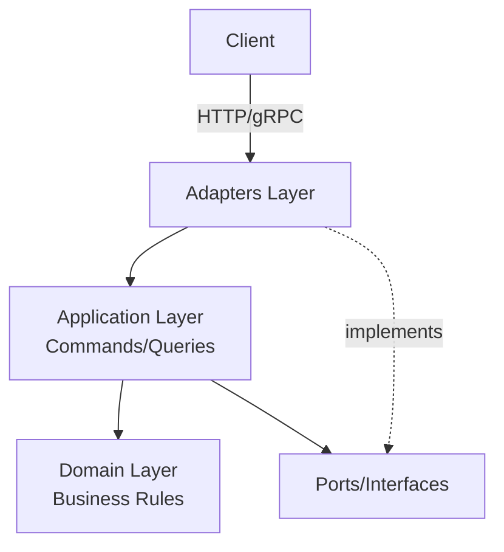
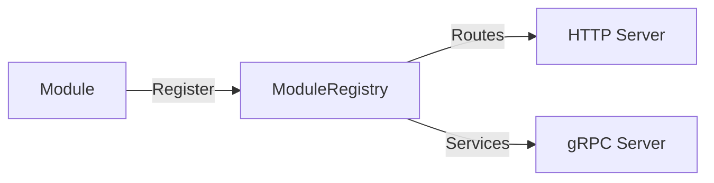

# 📚 Documentação do Artemis Framework

> **Framework modular em Go para aplicações enterprise**  
> Clean Architecture + Hexagonal + DDD + CQRS + Auto-Registro

---

## 🎯 Navegação Rápida

### 🆕 **NOVO! Documentação Completa do Framework**

👉 **[Framework - Guia Completo](framework/README.md)** - **COMECE AQUI!**

A documentação foi completamente reorganizada! Se você é um **novo desenvolvedor** ou quer usar o Artemis como **base para um novo projeto**, siga esta ordem:

1. **[Visão Geral](framework/01-overview.md)** - O que é e quando usar
2. **[Guia de Início Rápido](framework/02-quickstart.md)** - Crie seu primeiro módulo
3. **[Estrutura do Projeto](framework/03-project-structure.md)** - Organização de pastas
4. **[Arquitetura](framework/04-architecture.md)** - Clean Architecture, Hexagonal, DDD
5. **[Padrão CQRS](framework/05-cqrs-pattern.md)** - Commands e Queries
6. **[Sistema de Eventos](framework/08-events-system.md)** - Event-driven architecture
7. **[Boas Práticas](framework/23-best-practices.md)** - Convenções e recomendações

---

## � Para Desenvolvedores Iniciantes

**Novo no projeto?** Siga esta trilha:

```
1. Leia a Visão Geral do Framework
   └─► docs/framework/01-overview.md

2. Faça o Tutorial de Início Rápido
   └─► docs/framework/02-quickstart.md

3. Entenda a Estrutura do Projeto
   └─► docs/framework/03-project-structure.md

4. Crie seu Primeiro Módulo
   └─► docs/framework/12-creating-modules.md

5. Configure e Execute
   └─► make migrate && go run main.go
```

---

## � Organização da Documentação

### 📖 `/framework` - Documentação Principal (NOVO!)

**Documentação completa para uso do framework como base de projetos**

- Guias passo a passo
- Tutoriais práticos
- Referência de arquitetura
- Exemplos de código
- Boas práticas

👉 **[Acesse a documentação completa](framework/README.md)**

### 🎯 `/adr` - Architecture Decision Records

**Decisões arquiteturais tomadas no projeto**

- [001: Clean Architecture](adr/001-clean-architecture.md)
- [002: CQRS Pattern](adr/002-cqrs-pattern.md)
- [003: Module Auto-Registration](adr/003-module-auto-registration.md)

### 📦 `/archive` - Histórico de Refatorações

**Documentação de refatorações anteriores (referência histórica)**

- Sumários de implementação de features
- Guias de paginação legacy
- Documentação de fases de desenvolvimento

### 🛠️ `/guides` - Guias Específicos

**Guias práticos para tarefas específicas**

| Documento | Descrição | Status |
|-----------|-----------|--------|
| [EVENTS_GUIDE.md](./guides/EVENTS_GUIDE.md) | Sistema de eventos type-safe | ✅ |
| [CODE_EXAMPLES.md](./guides/CODE_EXAMPLES.md) | Exemplos práticos de código | ✅ |
| [QUICKSTART.md](./guides/QUICKSTART.md) | Início rápido | ✅ |

### 📚 Documentos de Referência

| Documento | Descrição | Status |
|-----------|-----------|--------|
| [ARCHITECTURE.md](./ARCHITECTURE.md) | Arquitetura detalhada com diagramas | ✅ |
| [MODULE_CREATION_GUIDE.md](./MODULE_CREATION_GUIDE.md) | Criar novos módulos | ✅ |
| [DEPLOYMENT.md](./DEPLOYMENT.md) | Guia de deployment | ✅ |

---

## 🎓 Trilhas de Aprendizado

### Para Novos Desenvolvedores

1. **Dia 1: Fundamentos**
   - [Visão Geral](framework/01-overview.md)
   - [Estrutura do Projeto](framework/03-project-structure.md)
   - [Arquitetura Geral](framework/04-architecture.md)

2. **Dia 2: Prática**
   - [Guia de Início Rápido](framework/02-quickstart.md)
   - [Criando um Módulo](framework/12-creating-modules.md)

3. **Dia 3: Aprofundamento**
   - [Padrão CQRS](framework/05-cqrs-pattern.md)
   - [Sistema de Eventos](framework/08-events-system.md)
   - [Boas Práticas](framework/23-best-practices.md)

### Para Arquitetos

1. [Arquitetura Completa](framework/04-architecture.md)
2. [ADRs](adr/README.md)
3. [Sistema de Módulos](framework/06-modules-system.md)
4. [Dependency Injection](framework/07-dependency-injection.md)

### Para DevOps

1. [Deployment Guide](DEPLOYMENT.md)
2. [Configuração](framework/16-configuration-bootstrap.md)
3. [Testes](framework/21-testing-strategy.md)

---

## 🌐 API Documentation (Swagger/OpenAPI)

| Recurso | Descrição | Status |
|---------|-----------|--------|
| [Swagger UI](http://localhost:8080/swagger/index.html) | Interface interativa da API | ✅ Funcional |
| [swagger.json](./swagger.json) | OpenAPI 3.0 Specification | ✅ Gerado |
| [swagger.yaml](./swagger.yaml) | OpenAPI YAML format | ✅ Gerado |

**Endpoints Documentados:** 16 endpoints (5 User + 6 Product + 5 Order)  
**Geração:** `swag init` (automático)

### 🚀 Deployment & Operações

| Documento | Descrição | Status |
|-----------|-----------|--------|
| [DEPLOYMENT.md](./DEPLOYMENT.md) | Guia completo de deployment | ✅ Completo |
| Docker Compose | Configuração multi-container | ✅ Incluído |
| Kubernetes | Manifests K8s | 🚧 Futuro |

### 📊 Progresso & Planejamento

| Documento | Descrição | Status |
|-----------|-----------|--------|
| [CHECKLIST.md](../CHECKLIST.md) | Checklist de refatoração (raiz do projeto) | ✅ 93% |
| [phases/FASE7.1_COMPLETO.md](./phases/FASE7.1_COMPLETO.md) | Resumo Fase 7.1 (Documentação) | ✅ Completo |
| [phases/FASE6_COMPLETO.md](./phases/FASE6_COMPLETO.md) | Resumo Fase 6 (Auto-registro) | ✅ Completo |
| [phases/FASE5_CONCLUSAO_FINAL.md](./phases/FASE5_CONCLUSAO_FINAL.md) | Resumo Fase 5 (Event Bus) | ✅ Completo |
| [phases/FASE4_COMPLETA.md](./phases/FASE4_COMPLETA.md) | Resumo Fase 4 (Domain Layer) | ✅ Completo |
| [phases/FASE3_CONCLUSAO.md](./phases/FASE3_CONCLUSAO.md) | Resumo Fase 3 (Application Layer) | ✅ Completo |

**Documentos Históricos:** Veja [archive/](./archive/) para planos e resumos iniciais da refatoração

### 🎯 Architecture Decision Records (ADRs)

| ADR | Título | Status | Data |
|-----|--------|--------|------|
| [001](./adr/001-clean-architecture.md) | Adoção de Clean Architecture | ✅ Aceito | 2025-10-01 |
| [002](./adr/002-cqrs-pattern.md) | Implementação do Padrão CQRS | ✅ Aceito | 2025-10-03 |
| [003](./adr/003-module-auto-registration.md) | Sistema de Auto-Registro de Módulos | ✅ Aceito | 2025-10-15 |

**[Ver todos os ADRs →](./adr/README.md)**

---

## 🎓 Trilha de Aprendizado

### Para Desenvolvedores Iniciantes

```
1. README.md
   ↓
2. QUICKSTART.md
   ↓
3. ARCHITECTURE.md (seções básicas)
   ↓
4. MODULE_CREATION_GUIDE.md (seguir tutorial)
   ↓
5. CODE_EXAMPLES.md
```

### Para Desenvolvedores Experientes

```
1. ARCHITECTURE.md (completo)
   ↓
2. ADRs (entender decisões)
   ↓
3. MODULE_CREATION_GUIDE.md (referência rápida)
   ↓
4. DEPLOYMENT.md (infraestrutura)
```

### Para Arquitetos/Tech Leads

```
1. ARCHITECTURE.md
   ↓
2. Todos os ADRs
   ↓
3. ARCHITECTURE_COMPARISON.md
   ↓
4. REFACTORING_INDEX.md
```

---

## 🔍 Busca Rápida

### "Como faço para..."

| Pergunta | Documento |
|----------|-----------|
| ...criar um novo módulo? | [MODULE_CREATION_GUIDE.md](./MODULE_CREATION_GUIDE.md) |
| ...entender a arquitetura? | [ARCHITECTURE.md](./ARCHITECTURE.md) |
| ...fazer deployment? | [DEPLOYMENT.md](./DEPLOYMENT.md) |
| ...usar o Event Bus? | [EVENTS_GUIDE.md](../EVENTS_GUIDE.md) |
| ...entender as decisões? | [ADRs](./adr/README.md) |
| ...ver exemplos de código? | [CODE_EXAMPLES.md](../CODE_EXAMPLES.md) |
| ...configurar variáveis de ambiente? | [DEPLOYMENT.md](./DEPLOYMENT.md#variáveis-de-ambiente) |
| ...rodar com Docker? | [DEPLOYMENT.md](./DEPLOYMENT.md#docker-e-docker-compose) |

### "O que é..."

| Conceito | Onde Aprender |
|----------|---------------|
| Clean Architecture | [ADR 001](./adr/001-clean-architecture.md) |
| CQRS | [ADR 002](./adr/002-cqrs-pattern.md) |
| Auto-Registro | [ADR 003](./adr/003-module-auto-registration.md) |
| Ports & Adapters | [ARCHITECTURE.md](./ARCHITECTURE.md#camadas-da-aplicação) |
| Event Bus Type-Safe | [EVENTS_GUIDE.md](../EVENTS_GUIDE.md) |
| ModuleRegistry | [ARCHITECTURE.md](./ARCHITECTURE.md#sistema-de-auto-registro) |

---

## 📊 Diagramas Importantes

### 🏗️ Arquitetura Geral



**[Ver diagrama completo →](./ARCHITECTURE.md#diagramas)**

### 📦 Auto-Registro



**[Ver fluxo completo →](./ARCHITECTURE.md#sistema-de-auto-registro)**

---

## 📈 Status do Projeto

### ✅ Concluído (92%)

- [x] Fase 1: Reorganização de Estrutura (100%)
- [x] Fase 2: Interfaces e Contratos (100%)
- [x] Fase 3: Camada de Application (100%)
- [x] Fase 4: Sistema de Erros (100%)
- [x] Fase 5: Event Bus Type-Safe (100%)
- [x] Fase 6: Auto-registro de Módulos (100%)
- [x] Fase 7.1: Documentação (80%)

### 🚧 Em Andamento

- [ ] Fase 7.2: Testes (0%)
- [ ] Fase 7.3: Observabilidade (0%)
- [ ] Fase 7.4: Performance/Segurança (0%)

**[Ver checklist completo →](../CHECKLIST.md)**

---

## 🤝 Contribuindo

### Como Adicionar Documentação

1. **Documentação Técnica**: Adicione em `docs/`
2. **ADRs**: Use template em `docs/adr/000-template.md`
3. **Exemplos**: Adicione em `CODE_EXAMPLES.md`
4. **Atualize este índice**: Não esqueça!

### Padrões de Documentação

- ✅ Use Markdown
- ✅ Adicione diagramas Mermaid quando possível
- ✅ Inclua exemplos de código
- ✅ Mantenha atualizado
- ✅ Use emojis para navegação visual

---

## 📞 Suporte

### Problemas Comuns

- **Compilação falha**: [DEPLOYMENT.md - Troubleshooting](./DEPLOYMENT.md#troubleshooting)
- **Docker não inicia**: [DEPLOYMENT.md - Docker](./DEPLOYMENT.md#docker-e-docker-compose)
- **Arquitetura confusa**: [ARCHITECTURE.md](./ARCHITECTURE.md)

### Contatos

- **Issues**: GitHub Issues
- **Discussões**: GitHub Discussions
- **Email**: team@artemis.dev

---

## 🔖 Versão

**Documentação:** v1.0  
**Projeto:** v1.0.0  
**Última Atualização:** 18 de Outubro de 2025

---

## 📚 Leitura Externa Recomendada

- [Clean Architecture - Robert C. Martin](https://blog.cleancoder.com/uncle-bob/2012/08/13/the-clean-architecture.html)
- [CQRS - Martin Fowler](https://martinfowler.com/bliki/CQRS.html)
- [Hexagonal Architecture - Alistair Cockburn](https://alistair.cockburn.us/hexagonal-architecture/)
- [Domain-Driven Design - Eric Evans](https://www.domainlanguage.com/ddd/)
- [Go Best Practices](https://go.dev/doc/effective_go)

---

**Mantido por:** Time Artemis  
**Licença:** MIT  
**Repository:** [github.com/your-org/artemis](https://github.com/your-org/artemis)
