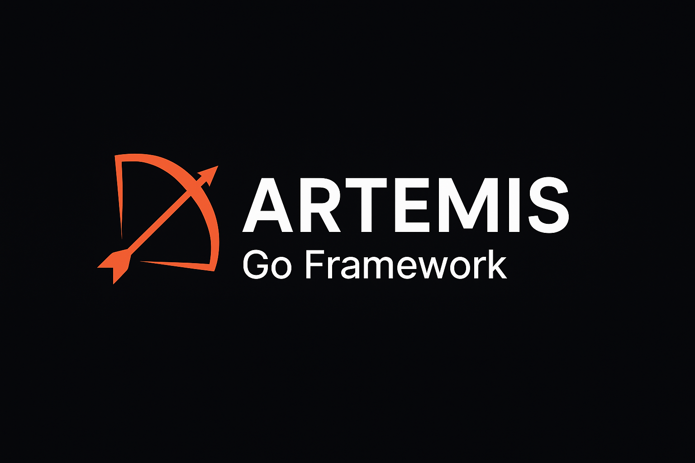

# 🏹 Artemis Go Framework



**Build monoliths, modularly.**

Artemis é um framework modular para Go que traz uma estrutura inspirada no Laravel,
com foco em produtividade e organização de código.

## ✨ Recursos
- Estrutura modular de alto desempenho.
- CLI poderoso (`artemis make:module users`).
- Suporte a múltiplas tecnologias (REST, gRPC, GraphQL, etc).
- Facilidade de configuração e extensibilidade.

## 🚀 Instalação
```bash
go install github.com/valdirsb/artemis@latest
```

## 🧩 Criando um novo projeto
```bash
artemis new myapp
```

## ⚙️ Gerando módulos
```bash
cd myapp
artemis make:module users
```

## 📦 Estrutura
```
app/
├── cmd/                          # Pontos de entrada da aplicação
│   └── server/
│       └── main.go              # Main da aplicação
├── internal/                     # Código interno da aplicação
│   ├── bootstrap/               # Configuração de DI e inicialização
│   │   ├── bootstrap.go
│   │   └── mocks.go
│   ├── shared/                  # Recursos compartilhados
│   │   ├── config/
│   │   ├── database/
│   │   ├── logger/
│   │   └── middleware/
│   └── modules/                 # Módulos de domínio organizados
│       └── {module}/            # Cada módulo (user, product, order)
│           ├── domain/          # Entidades e regras de negócio
│           │   ├── {entity}.go
│           │   └── repository.go # Interface do repositório
│           ├── ports/           # Interfaces (Primary e Secondary Ports)
│           │   └── ports.go
│           ├── service/         # Casos de uso/aplicação
│           │   └── {module}_service.go
│           ├── adapters/        # Implementações de interfaces externas
│           │   └── {adapter}.go
│           ├── repository/      # Implementação de persistência
│           │   └── {module}_repository.go
│           └── handler/         # Controllers/HTTP Handlers
│               └── {module}_handler.go
├── pkg/                         # Código reutilizável
│   ├── contracts/               # Interfaces e contratos globais
│   │   ├── interfaces.go        # Interfaces de domínio
│   │   └── infrastructure.go    # Interfaces de infraestrutura
│   ├── container/               # DI Container
│   │   └── container.go
│   └── events/                  # Sistema de eventos
│       └── eventbus.go
├── go.mod
├── go.sum
└── README.md
```

## 🛠️ Em desenvolvimento
- [ ] Gerador de migrations
- [ ] Integração com Docker
- [ ] Middleware e Providers
- [ ] CLI para testes e seeds

## 📜 Licença
MIT © 2025 - Valdir Barbosa
