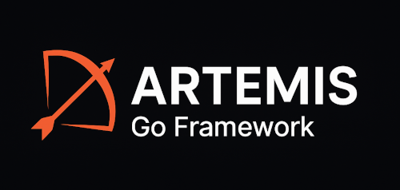
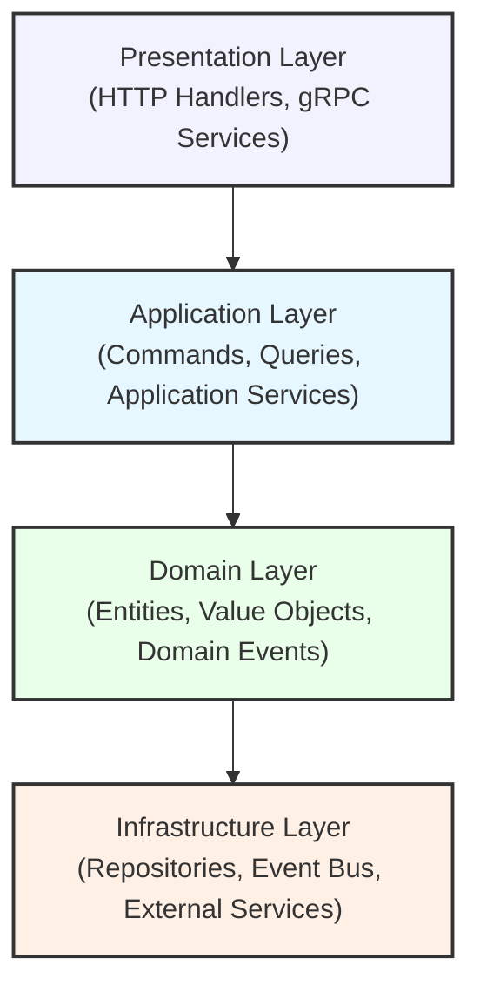

# 🏹 Artemis Go Framework
**Build monoliths, modularly.**

<div align="center">


<br>
**Framework modular para desenvolvimento de aplicações Go enterprise**


[📚 Documentação Completa](docs/framework/README.md) • [🚀 Início Rápido](docs/framework/02-quickstart.md) • [🏗️ Arquitetura](docs/ARCHITECTURE.md)

</div>

---

## 🎯 O que é o Artemis?

O **Artemis Framework** é um framework empresarial em Go que implementa Clean Architecture, Hexagonal Architecture (Ports & Adapters), Domain-Driven Design (DDD) e CQRS. Ele fornece uma base sólida e padronizada para desenvolvimento de aplicações complexas e escaláveis.

### ⭐ Principais Características

✅ **Clean Architecture** - Separação clara de responsabilidades  
✅ **Modular** - Sistema de módulos auto-registráveis  
✅ **CQRS** - Separação entre Commands e Queries  
✅ **DI Container** - Injeção de dependências poderosa  
✅ **Multi-Protocol** - HTTP (REST) e gRPC nativos  
✅ **Event-Driven** - Sistema de eventos assíncrono  
✅ **Type-Safe** - Forte tipagem em todas as camadas  
✅ **Testável** - Arquitetura facilita testes em todos os níveis  

---

## ✨ Recursos
- ✅ Estrutura modular de alto desempenho
- ✅ CLI poderoso para geração de código  
- ✅ Comando `artemis new` para criar projetos
- ✅ Comando `artemis make:module` para gerar módulos
- ✅ Sistema de templates flexível
- 🚧 Suporte a múltiplas tecnologias (REST, gRPC, GraphQL, etc)
- 🚧 Facilidade de configuração e extensibilidade

## 🚀 Instalação

### Via Go Install (Recomendado)
```bash
go install github.com/valdirsb/artemis@latest
```

### Via Build Manual
```bash
git clone https://github.com/valdirsb/artemis.git
cd artemis
go build -o bin/artemis .
# Copiar o binário para seu PATH
```

## 🧩 Como usar

### Criando um novo projeto
```bash
artemis new myapp
cd myapp
```

### Gerando módulos
```bash
artemis make:module users    # Gera módulo completo
artemis make:migration create_users_table
```

## 🎯 Comandos Disponíveis

| Comando | Descrição | Exemplo |
|---------|-----------|---------|
| `artemis new <name>` | Cria novo projeto | `artemis new myapp` |
| `artemis make:module <name>` | Gera módulo | `artemis make:module users` |
| `artemis make:migration <name>` | Gera migration | `artemis make:migration create_users` |

## 📁 Estrutura Gerada

## 📦 Estrutura
```
meuApp/
├── docs/
│   └── framework/         # 📚 DOCUMENTAÇÃO COMPLETA
│       ├── README.md      # Índice da documentação
│       ├── 01-overview.md
│       ├── 02-quickstart.md
│       └── ...
│
├── internal/
│   ├── bootstrap/         # Inicialização e DI
│   └── modules/           # Módulos da aplicação
│       ├── user/
│       ├── product/
│       └── order/
│
├── pkg/                   # Código compartilhável
│   ├── adapters/         # Database, HTTP, Logger
│   ├── container/        # DI Container + Registry
│   ├── contracts/        # Interfaces
│   ├── events/           # Event Bus
│   └── framework/        # Core do framework
│
├── proto/                # Protocol Buffers
├── tests/                # Testes E2E
├── framework.yaml        # Configuração do framework
└── main.go              # Entry point
```

---

## 📚 Documentação

### 🎓 Para Iniciantes

- **[Visão Geral do Framework](docs/framework/01-overview.md)** - Conceitos e filosofia
- **[Guia de Início Rápido](docs/framework/02-quickstart.md)** - Crie seu primeiro módulo
- **[Estrutura do Projeto](docs/framework/03-project-structure.md)** - Organização de pastas

### 🏗️ Arquitetura

- **[Arquitetura Geral](docs/framework/04-architecture.md)** - Clean Architecture e DDD
- **[Padrão CQRS](docs/framework/05-cqrs-pattern.md)** - Commands e Queries
- **[Sistema de Módulos](docs/framework/06-modules-system.md)** - Módulos auto-registráveis
- **[Dependency Injection](docs/framework/07-dependency-injection.md)** - Container DI

### 🔧 Componentes

- **[Sistema de Eventos](docs/framework/08-events-system.md)** - Event Bus e Domain Events
- **[Adapters](docs/framework/09-adapters.md)** - HTTP, gRPC, Database
- **[Contratos e Interfaces](docs/framework/10-contracts-interfaces.md)** - Ports & Adapters

### 📖 Guias Práticos

- **[Criando um Módulo](docs/framework/12-creating-modules.md)** - Tutorial completo
- **[Implementando Commands](docs/framework/13-implementing-commands.md)** - Write operations
- **[Implementando Queries](docs/framework/14-implementing-queries.md)** - Read operations

### 🎯 Boas Práticas

- **[Boas Práticas](docs/framework/23-best-practices.md)** - Convenções e recomendações
- **[Estratégia de Testes](docs/framework/21-testing-strategy.md)** - Testes eficazes

---

## 🏛️ Arquitetura



### Princípios Fundamentais

- **Inversão de Dependências** - Dependa de abstrações
- **Separação de Responsabilidades** - Cada camada tem seu papel
- **Modularidade** - Módulos independentes e desacoplados
- **Testabilidade** - Fácil testar em todos os níveis

👉 **[Veja a arquitetura completa →](docs/framework/04-architecture.md)**

---


## 🔥 Recursos Principais

### 1. Sistema de Módulos Auto-Registráveis

Cada módulo se registra automaticamente no framework:

```go
func (m *UserModule) Register(registry *container.ModuleRegistry) error {
    // Registra componentes automaticamente
    registry.RegisterRepository("user", userRepo)
    registry.RegisterApplicationService("user", userService)
    registry.RegisterHTTPHandler("user", httpHandler)
    return nil
}
```

### 2. CQRS Pattern

Separação clara entre leitura e escrita:

```go
// Commands (Write)
type CreateUserCommand struct {
    Name  string
    Email string
}

// Queries (Read)
type ListUsersQuery struct {
    Page     int
    PageSize int
}
```

### 3. Event-Driven Architecture

```go
// Publicar eventos
eventBus.Publish("user.created", UserCreatedEvent{
    UserID: user.ID,
    Email:  user.Email,
})

// Subscrever
eventBus.Subscribe("user.created", func(event Event) error {
    // Processar evento
})
```

### 4. Multi-Protocol Support

```yaml
# framework.yaml
protocols:
  http: true    # REST API
  grpc: true    # gRPC API
```

---

## 🧪 Testes

```bash
# Testes unitários
go test ./internal/modules/...

# Testes de integração
go test ./tests/integration/...

# Testes E2E
go test ./tests/e2e/...

# Coverage
go test -cover ./...
```

---

## 📚 Documentação Adicional

- **[ADRs](docs/adr/README.md)** - Architecture Decision Records
- **[Deployment](docs/DEPLOYMENT.md)** - Guia de deploy
- **[API Reference](docs/framework/24-api-reference.md)** - Referência da API

---

## 🤝 Contribuindo

Contribuições são bem-vindas! Por favor, leia nosso [guia de contribuição](CONTRIBUTING.md).

1. Fork o projeto
2. Crie uma branch (`git checkout -b feature/AmazingFeature`)
3. Commit suas mudanças (`git commit -m 'Add some AmazingFeature'`)
4. Push para a branch (`git push origin feature/AmazingFeature`)
5. Abra um Pull Request

---

## 📄 Licença

Este projeto está sob a licença MIT. Veja o arquivo [LICENSE](LICENSE) para mais detalhes.

---

## 👥 Equipe

Desenvolvido com ❤️ pela Equipe de Desenvolvimento Artemis

---

## 📞 Suporte

- 📧 Email: valdirsb.dev@gmail.com
<!-- - 💬 Slack: #artemis-framework -->
- 📖 Wiki: [Documentação Completa](docs/framework/README.md)

---

<div align="center">

**[⬆️ Voltar ao topo](#Artemis-Go-Framework)**

**[📚 Documentação Completa](docs/framework/README.md)** | **[🚀 Início Rápido](docs/framework/02-quickstart.md)** | **[🏗️ Arquitetura](docs/ARCHITECTURE.md)**

</div>


---

