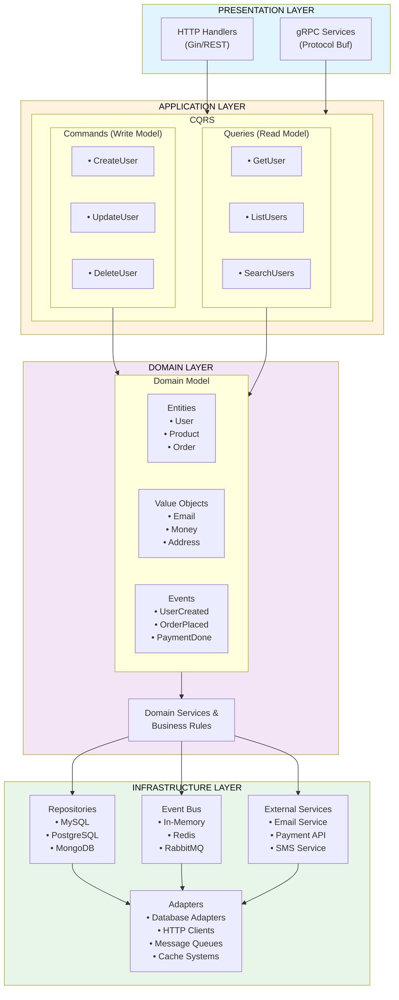
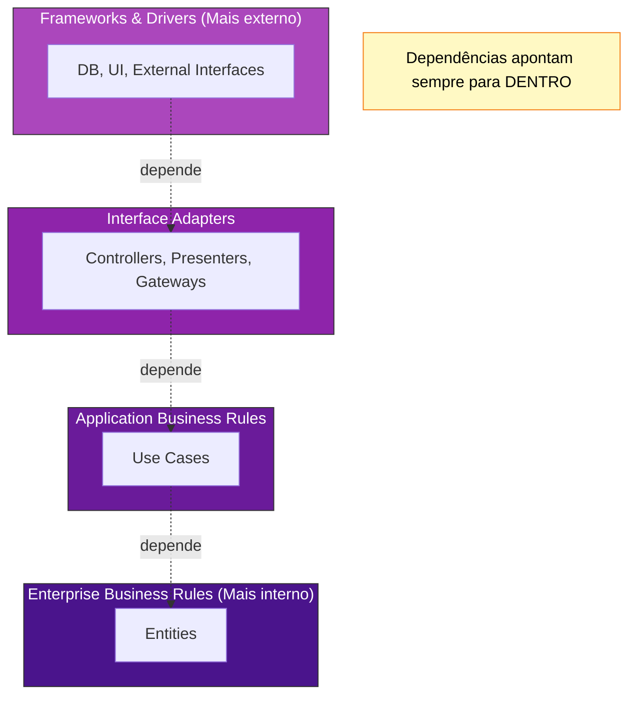
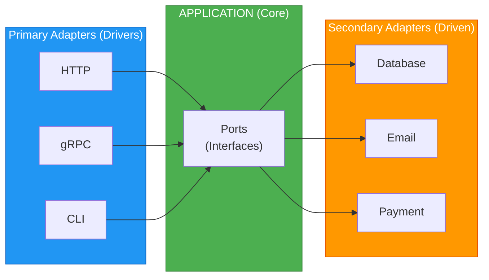
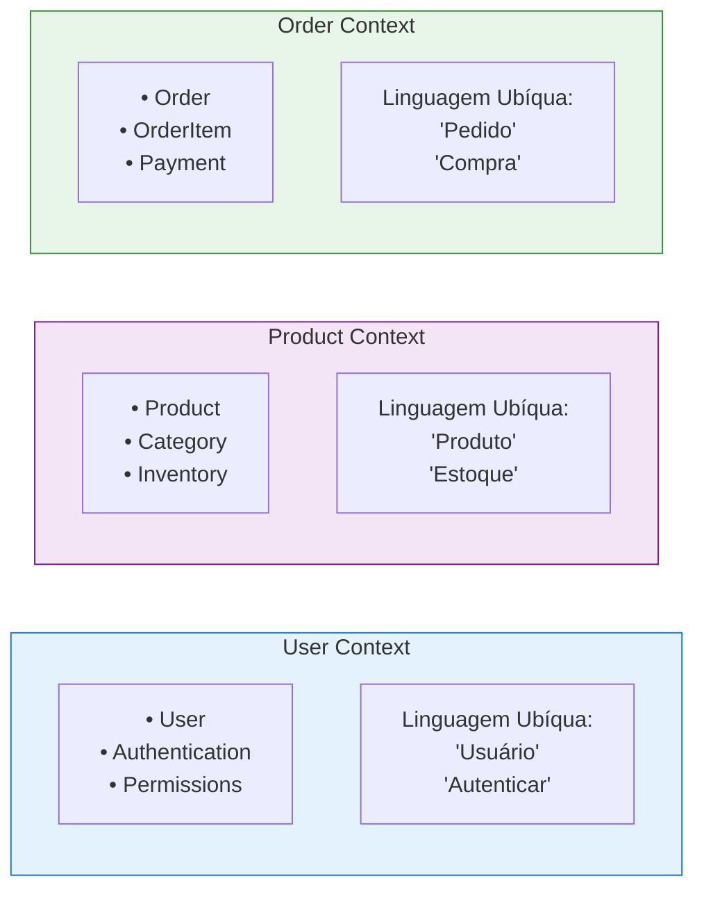
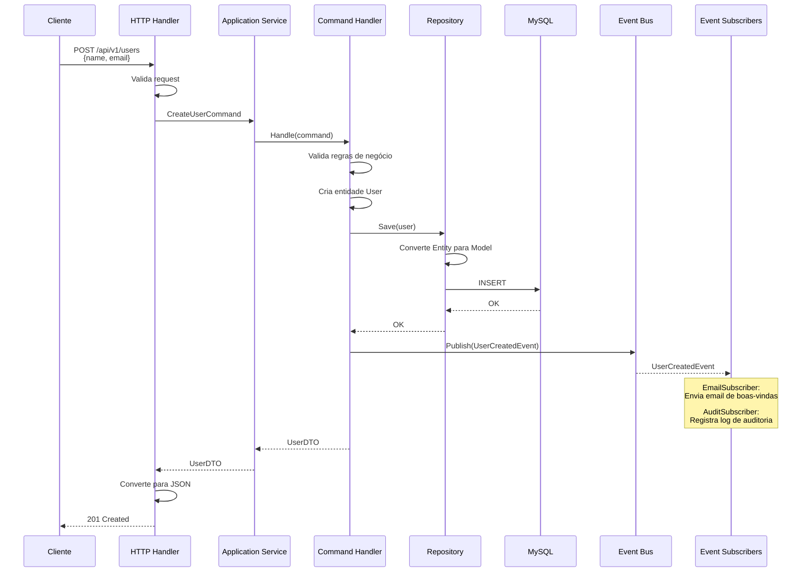

# 🏗️ Arquitetura do Artemis Framework

## 📋 Índice
- [Visão Geral da Arquitetura](#visão-geral-da-arquitetura)
- [Clean Architecture](#clean-architecture)
- [Hexagonal Architecture](#hexagonal-architecture)
- [Domain-Driven Design](#domain-driven-design)
- [Fluxo de uma Requisição](#fluxo-de-uma-requisição)
- [Estrutura de Camadas](#estrutura-de-camadas)

---

## 🎯 Visão Geral da Arquitetura

O Artemis Framework implementa uma arquitetura em camadas que combina Clean Architecture, Hexagonal Architecture (Ports & Adapters) e Domain-Driven Design (DDD).

### 📐 Diagrama Geral



---

## 🧼 Clean Architecture

### Princípios Fundamentais

A Clean Architecture é baseada em camadas concêntricas onde as dependências apontam para dentro:



### Regras de Dependência

1. **Círculo Interno não conhece o Externo**
   ```go
   // ✅ CORRETO: Domain não depende de Infrastructure
   package domain
   
   type User struct {
       ID    string
       Email string
   }
   ```

2. **Inversão de Dependências**
   ```go
   // ✅ CORRETO: Application depende de interface
   package application
   
   type CreateUserHandler struct {
       repo UserRepository  // Interface, não implementação
   }
   
   type UserRepository interface {
       Save(user *domain.User) error
   }
   ```

3. **Dados fluem do Exterior para o Interior**
   ```go
   // HTTP Request → DTO → Command → Entity
   HTTPRequest → CreateUserRequest → CreateUserCommand → User
   ```

### Benefícios da Clean Architecture

✅ **Independência de Frameworks** - Não fica preso a frameworks específicos  
✅ **Testabilidade** - Regras de negócio podem ser testadas sem UI, DB, etc  
✅ **Independência de UI** - UI pode mudar sem afetar regras de negócio  
✅ **Independência de Database** - Pode trocar MySQL por Postgres facilmente  
✅ **Independência de Agentes Externos** - Regras não sabem sobre o mundo externo  

---

## 🔶 Hexagonal Architecture (Ports & Adapters)

A Arquitetura Hexagonal complementa a Clean Architecture focando na separação entre a aplicação e o mundo externo.

### Conceitos Principais



### Ports (Interfaces)

**Primary Ports** - Como o mundo externo acessa sua aplicação:

```go
// Port: Interface que a aplicação expõe
type UserApplicationService interface {
    CreateUser(cmd *CreateUserCommand) (*UserResponse, error)
    GetUser(query *GetUserQuery) (*UserResponse, error)
}

// Adapter: HTTP Handler implementa acesso via REST
type UserHTTPHandler struct {
    service UserApplicationService
}

// Adapter: gRPC Service implementa acesso via gRPC
type UserGRPCService struct {
    service UserApplicationService
}
```

**Secondary Ports** - Como sua aplicação acessa recursos externos:

```go
// Port: Interface que a aplicação precisa
type UserRepository interface {
    Save(user *User) error
    FindByID(id string) (*User, error)
}

// Adapter: Implementação MySQL
type MySQLUserRepository struct {
    db *gorm.DB
}

// Adapter: Implementação MongoDB
type MongoUserRepository struct {
    client *mongo.Client
}
```

### Adapters no Artemis

```
internal/modules/user/
├── application/           # Core da aplicação
│   ├── commands/         # Casos de uso (Write)
│   └── queries/          # Casos de uso (Read)
│
├── domain/               # Regras de negócio
│   ├── entities/
│   └── value_objects/
│
├── ports/                # Interfaces
│   ├── incoming/        # Primary ports
│   └── outgoing/        # Secondary ports
│
└── adapters/            # Implementações
    ├── http/           # REST API adapter
    ├── grpc/           # gRPC adapter
    ├── repository/     # Database adapter
    └── subscribers/    # Event subscribers
```

---

## 🎯 Domain-Driven Design (DDD)

### Conceitos DDD no Artemis

#### 1. **Entities** - Objetos com identidade

```go
// Entity tem identidade única (ID)
type User struct {
    ID        string    // Identidade
    Email     string
    Name      string
    CreatedAt time.Time
}

// Dois usuários são iguais se têm o mesmo ID
func (u *User) Equals(other *User) bool {
    return u.ID == other.ID
}
```

#### 2. **Value Objects** - Objetos imutáveis sem identidade

```go
// Value Object - sem ID, imutável
type Email struct {
    value string
}

func NewEmail(email string) (*Email, error) {
    if !isValidEmail(email) {
        return nil, errors.New("invalid email")
    }
    return &Email{value: email}, nil
}

// Dois emails são iguais se têm o mesmo valor
func (e *Email) Equals(other *Email) bool {
    return e.value == other.value
}
```

#### 3. **Aggregates** - Cluster de objetos tratados como unidade

```go
// Order é um Aggregate Root
type Order struct {
    ID          string
    UserID      string
    Items       []OrderItem  // Parte do aggregate
    TotalAmount Money
    Status      OrderStatus
}

// Regra: Só podemos modificar OrderItems através de Order
func (o *Order) AddItem(product Product, quantity int) error {
    if o.Status != StatusDraft {
        return errors.New("cannot modify confirmed order")
    }
    
    item := OrderItem{
        ProductID: product.ID,
        Quantity:  quantity,
        Price:     product.Price,
    }
    
    o.Items = append(o.Items, item)
    o.recalculateTotal()
    
    return nil
}
```

#### 4. **Domain Events** - Algo que aconteceu no domínio

```go
// Evento de domínio
type UserCreatedEvent struct {
    UserID    string
    Email     string
    Name      string
    OccurredAt time.Time
}

// Publicar evento após criar usuário
func (h *CreateUserHandler) Handle(cmd *CreateUserCommand) error {
    user := &User{
        ID:    generateID(),
        Email: cmd.Email,
        Name:  cmd.Name,
    }
    
    if err := h.repo.Save(user); err != nil {
        return err
    }
    
    // Publicar evento
    event := UserCreatedEvent{
        UserID:    user.ID,
        Email:     user.Email,
        Name:      user.Name,
        OccurredAt: time.Now(),
    }
    
    h.eventBus.Publish("user.created", event)
    
    return nil
}
```

#### 5. **Repositories** - Persistência de Aggregates

```go
// Repository cuida da persistência do aggregate
type OrderRepository interface {
    Save(order *Order) error
    FindByID(id string) (*Order, error)
    FindByUserID(userID string) ([]*Order, error)
}

// Implementação esconde detalhes do banco
type MySQLOrderRepository struct {
    db *gorm.DB
}

func (r *MySQLOrderRepository) Save(order *Order) error {
    // Salva Order e todos os OrderItems atomicamente
    return r.db.Transaction(func(tx *gorm.DB) error {
        if err := tx.Save(order).Error; err != nil {
            return err
        }
        return tx.Save(&order.Items).Error
    })
}
```

#### 6. **Domain Services** - Lógica que não pertence a uma entidade

```go
// Domain Service para operações envolvendo múltiplas entidades
type OrderPricingService struct{}

func (s *OrderPricingService) CalculateTotal(
    items []OrderItem,
    discount *Discount,
    shipping *Shipping,
) Money {
    subtotal := s.calculateSubtotal(items)
    discountAmount := s.applyDiscount(subtotal, discount)
    shippingCost := s.calculateShipping(items, shipping)
    
    return subtotal.Subtract(discountAmount).Add(shippingCost)
}
```

### Bounded Contexts

Cada módulo representa um Bounded Context:



---

## 🔄 Fluxo de uma Requisição

### Exemplo: Criar um Usuário via REST API



### Diagrama de Sequência Detalhado

> **Nota:** O diagrama de sequência detalhado já foi substituído pela versão Mermaid na seção anterior.

---

## 📊 Estrutura de Camadas Detalhada

### 1. Presentation Layer (Adapters Primários)

**Responsabilidade**: Interface com o mundo externo

```
internal/modules/user/adapters/
├── http/
│   ├── handler.go           # REST endpoints
│   ├── middleware.go         # Middlewares HTTP
│   └── dto/
│       ├── request.go
│       └── response.go
│
└── grpc/
    ├── service.go           # gRPC service
    └── mapper.go            # Proto ↔ Domain
```

**Características**:
- ✅ Recebe requisições externas
- ✅ Valida formato de entrada
- ✅ Converte DTOs em Commands/Queries
- ✅ Formata respostas (JSON, Protobuf, etc)
- ❌ NÃO contém lógica de negócio

### 2. Application Layer (Casos de Uso)

**Responsabilidade**: Orquestração dos casos de uso

```
internal/modules/user/application/
├── commands/               # Write operations
│   ├── create_user.go
│   ├── update_user.go
│   └── delete_user.go
│
├── queries/               # Read operations
│   ├── get_user.go
│   ├── list_users.go
│   └── search_users.go
│
└── services/
    └── user_service.go    # Application Service
```

**Características**:
- ✅ Implementa casos de uso
- ✅ Coordena fluxo entre camadas
- ✅ Gerencia transações
- ✅ Publica eventos de domínio
- ❌ NÃO contém regras de negócio core

### 3. Domain Layer (Coração do Sistema)

**Responsabilidade**: Regras de negócio e lógica do domínio

```
internal/modules/user/domain/
├── entities/
│   └── user.go            # Entidade User
│
├── value_objects/
│   ├── email.go
│   └── password.go
│
├── events/
│   ├── user_created.go
│   └── user_updated.go
│
└── services/
    └── user_domain_service.go
```

**Características**:
- ✅ Regras de negócio puras
- ✅ Validações de domínio
- ✅ Invariantes e constraints
- ✅ Totalmente independente
- ❌ Zero dependências externas

### 4. Infrastructure Layer (Adapters Secundários)

**Responsabilidade**: Implementações técnicas

```
internal/modules/user/
├── repository/
│   ├── mysql_repository.go
│   └── cache_repository.go
│
└── adapters/
    ├── email_service.go
    ├── password_hasher.go
    └── logger.go
```

**Características**:
- ✅ Acesso a banco de dados
- ✅ Integrações externas
- ✅ File system, cache, etc
- ✅ Implementa interfaces do domain
- ❌ Não contém lógica de negócio

---

## 🎨 Princípios de Design

### 1. Separation of Concerns
Cada camada tem responsabilidade única e bem definida.

### 2. Dependency Inversion
```go
// ❌ ERRADO: Handler depende de implementação
type CreateUserHandler struct {
    repo *MySQLUserRepository  // Acoplamento!
}

// ✅ CORRETO: Handler depende de abstração
type CreateUserHandler struct {
    repo UserRepository  // Interface!
}
```

### 3. Single Responsibility
```go
// Cada handler tem UMA responsabilidade
type CreateUserHandler struct {
    repo UserRepository
}

type UpdateUserHandler struct {
    repo UserRepository
}

type DeleteUserHandler struct {
    repo UserRepository
}
```

### 4. Open/Closed
```go
// Fácil adicionar novos adapters sem modificar código existente
type EmailService interface {
    Send(to, subject, body string) error
}

type SMTPEmailService struct{}  // Implementação 1
type SendGridService struct{}   // Implementação 2
type MockEmailService struct{}  // Implementação 3
```

---

## 📚 Próximos Passos

- **[Padrão CQRS](05-cqrs-pattern.md)** - Entenda Commands e Queries
- **[Sistema de Módulos](06-modules-system.md)** - Como módulos funcionam
- **[Dependency Injection](07-dependency-injection.md)** - DI Container

---

**[⬅️ Visão Geral](01-overview.md)** | **[Índice](README.md)** | **[CQRS ➡️](05-cqrs-pattern.md)**
